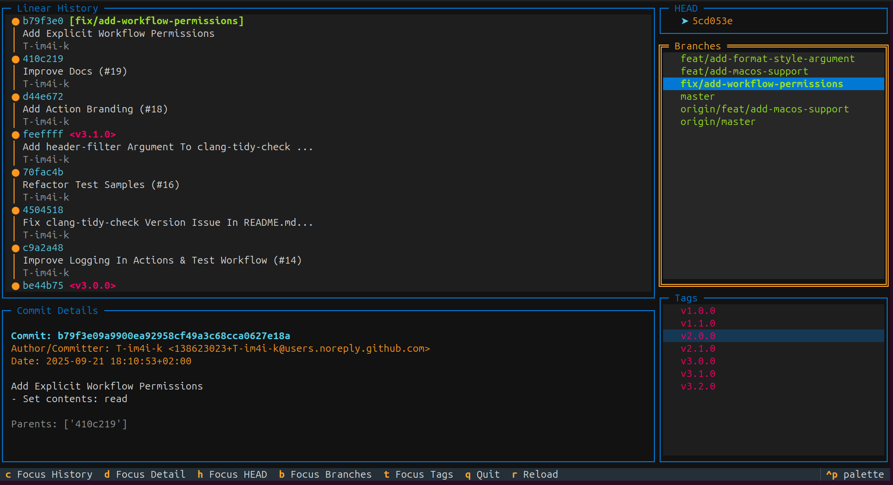

# GitterGraph

**A git graph in your terminal.**

GitterGraph is a fast, interactive TUI (Terminal User Interface) for exploring git repositories. Designed for developers
who prefer a clean, keyboard-driven interface for a modern terminal experience.



---

## Features

### Linear History Visualization

GitterGraph follows the **first-parent chain** (similar to `git log --graph --first-parent`), displaying a clean, linear
history that:

- **Follows the mainline path** — shows the actual progression of your project
- **Supports trunk-based development** — clear visualization of your main branch story
- **Reduces visual clutter** — one commit after another, without noise from merged branches

No need to get lost in the forest of feature branches. GitterGraph shows you the clean, logical progression that
matters.

### What You Can Do

- Browse commit history with author information, dates, and messages
- View all branches and tags at a glance
- Inspect detailed commit information
- Navigate between panels using keyboard shortcuts
- Filter history by branches and tags
- Live reload repository state without restarting

### Built for Performance

- **Fast startup** — built with [pygit2](https://www.pygit2.org/) (libgit2 bindings) for native performance
- **Keyboard-driven** — navigate efficiently without touching your mouse
- **Responsive interface** — built with [Textual](https://www.textualize.io/), a modern Python TUI framework

---

## Installation

### Requirements

- Python >=3.12
- GNU Make >=4.3
- pip >=24.0
- Git repository

### Getting Started

**Clone the repository:**

```bash
# Clone via HTTPS
git clone https://github.com/T-im4i-k/gittergraph.git

# Or via SSH
git clone git@github.com:T-im4i-k/gittergraph.git
```

**Install using the provided Makefile:**

```bash
# Install in development mode with dev dependencies
make install-dev

# Or install the package only
make install
```

This installs GitterGraph and all required dependencies defined in `pyproject.toml`.

---

## Usage

### Launching the Application

GitterGraph can be launched from any directory and automatically discovers git repositories by searching upward from
your current location.

```bash
# Auto-discover repository from current directory
gittergraph

# Specify a repository path
gittergraph /path/to/repo

# Works from subdirectories (searches upward for .git)
gittergraph ./some/nested/directory
```

### Keyboard Shortcuts

The application is fully navigable via keyboard:

| Key       | Action               |
|-----------|----------------------|
| `c`       | Focus commit history |
| `d`       | Focus commit details |
| `h`       | Focus HEAD           |
| `b`       | Focus branches       |
| `t`       | Focus tags           |
| `r`       | Reload repository    |
| `q`       | Quit application     |
| `↑` / `↓` | Navigate lists       |
| `Enter`   | Select item          |

---

## Development

GitterGraph is built with modern Python practices and comprehensive tooling. The codebase is fully typed, well-tested,
and follows consistent style conventions.

### Technology Stack

- **[Textual](https://www.textualize.io/)** — Python TUI framework
- **[pygit2](https://www.pygit2.org/)** — Python bindings to libgit2
- **[pytest](https://docs.pytest.org/en/stable/)** — testing framework with async support
- **[mypy](https://mypy-lang.org/)** — static type checking
- **[pylint](https://www.pylint.org/)** — code linting
- **[black](https://github.com/psf/black)** + **[isort](https://pycqa.github.io/isort/)** — code formatting

### Project Structure

```
gittergraph/
├── src/gittergraph/
│   ├── access/        # Git repository access layer (pygit2 wrappers)
│   ├── core/          # Graph data structures and algorithms
│   ├── models/        # Data models (Commit, Branch, Tag, etc.)
│   ├── tui/           # Textual TUI components
│   │   ├── app.py     # Main application
│   │   ├── screens/   # Full-screen views
│   │   ├── panels/    # Composite UI panels
│   │   └── widgets/   # Reusable UI widgets
│   └── utils/         # Utility functions
└── tests/             # Test suite
```

### Development Workflow

Use the provided Makefile targets to streamline your development workflow:

```bash
# Format source code
make format

# Check source code formatting
make check-format

# Run linter on source code
make lint

# Run type checker on source code
make mypy

# Run test suite
make test

# Run all checks (check-format + lint + mypy + test)
make check
```

**Comprehensive targets:**

```bash
make format-all          # Format both source and tests
make check-format-all    # Check formatting of both source and tests
make lint-all            # Lint both source and tests
make mypy-all            # Type-check both source and tests
make check-all           # Run comprehensive checks on all code
```

### Running Tests

Run the test suite using the Makefile or pytest directly:

```bash
# Run all tests with Makefile
make test

# Use pytest directly
pytest tests/

# Run specific test file
pytest tests/unit/tui/test_app.py
```

**Coverage report:**

```bash
# Generate coverage report
make test-cov

# Or use pytest directly with coverage
pytest --cov=gittergraph tests/
```

### Code Quality Standards

The project maintains strict code quality requirements:

- **Type hints** — full type annotations with mypy
- **Test coverage** — comprehensive unit tests for all components
- **Code formatting** — consistent style with black and isort
- **Documentation** — Google-style docstrings throughout
- **Linting** — clean pylint checks

---

## Acknowledgments

GitterGraph wouldn't be possible without these excellent open-source projects:

- [Textual](https://github.com/Textualize/textual) - Python TUI framework that powers the interface
- [pygit2](https://github.com/libgit2/pygit2) - Fast git access via libgit2 bindings

---

**Made by developers, for developers.**

